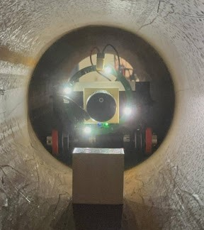

| [home page](https://xujinyun.github.io/MyDataStory/) | [visualizing debt](visualizing-government-debt) | [critique by design](critique-by-design) | [final project I](final-project-part-one) | [final project II](final-project-part-two) | [final project III](final-project-part-three) |

# Portfolio Website
This personal portfolio is forked from [Telling Stories with Data site](https://github.com/cmustudent/tswd-portfolio-templates/).  
- Web page URL: https://xujinyun.github.io/MyDataStory/
- This repository: https://github.com/xujinyun/MyDataStory

# Portfolio
This is my public portfolio for Telling Stories with Data at CMU!  Here's where all my cool work will go. Want to know more about my cool ROBOT? Contact me!
# About me
Hi! This Jinyun Xu from Robotics Institute. Surprise! I have always had an obsession with the graphs appearing in my papers and slides. That's why I come here to study data visualization. I hope it can enhance my papers and slides.

  

  <em>Beautiful sunset in Santa Monica, Dec 2023.</em>

I am a Master student graduating this summer. Looking for Robotics Engineer job. Here are some cool robot I made in CMU, will be updated!

  

    

       
      
<em>Earthworm: link coming soon</em>

    

    

        
      
<em> Robospect: https://mrsdprojects.ri.cmu.edu/2023teamg/ </em>

    

  

# What I hope to learn
- I want to learn how to make my graphs on paper fantastic. Although I am proficient in creating graphs in PowerPoint, I aspire to enhance my skills further.
- I have a strong interest in data because it holds truth, but its impact depends on how the story is told. I hope to acquire the ability to **tell** and to *tell*.
- As a robotic engineer, my goal is to continue building cool and innovative projects.

# Portfolio

# Examples
You can keep this section for stuff from in-class demos or your other work, or remove it. 

## Assignment: [Visualizing overnment Debt](visualizing-government-debt)
For this assignment, make sure you set up and link to a new page.  This page is linking to a new Markdown document called `visualizing-government-debt.md`.  For links to Markdown files in your repository, you can just include the name of the page without the `.md` extension. 

## Assignment 3&4: [Critique by Design](critique-by-design)
For this assignment, make sure you set up and link to a new page.  This page is linking to a new Markdown document called `critique-by-design.md`.  

## Final project
Here it might be helpful to include a high-level description of your final project. 
[Part I](final-project-part-one)
[Part II](final-project-part-two)
Part III(final-project-part-three)

---
## Other stuff you can do (you can remove this section - it's just for your reference.)

### Changing text

You can change text, like this: 

**Here's some bold** text.  Here's some *italic* text. Here's some ~~strikethrough~~ text. 

### Creating tables

You can build tables like this: 

| Name         | Type of pet | Favority activity 1 | FA 2   | FA 3            | FA 4                                |
|--------------|-------------|---------------------|--------|-----------------|-------------------------------------|
| Eli          | cat         | Sleeping            | Eating | Being pet       | Plotting to overthow dog empire     |
| Howard       | dog         | You                 | You    | You             | Eating                              |
| Frankenstein | fish        | Swimming            | Eating | Blowing bubbles | Forgetting                          |

An easy-to-use template generator tool [can be found here](https://www.tablesgenerator.com/markdown_tables)

You can use different headings, like this: 

# Here's a large title (H1)
## Here's a subtitle (H2)
### ...and so on (H3)
You get the idea - just don't forget the space between the # and your title.  `#Title` won't work, but `# Title` will. 

### Adding images

Here's an example of how to add an image to my portfolio.  

> Photo by <a href="https://unsplash.com/pt-br/@charlesdeluvio?utm_source=unsplash&utm_medium=referral&utm_content=creditCopyText">charlesdeluvio</a> on <a href="https://unsplash.com/photos/K4mSJ7kc0As?utm_source=unsplash&utm_medium=referral&utm_content=creditCopyText">Unsplash</a>
  

Alternately, you can set the size of the image using just a bit of HTML: 

Remember that you'll need to upload the image into your repository, or include a link to the image somewhere else.  

### Setting up a separate page

So here's the code you'll need to add to your own site to create a second page. 

1. First, create a new page in your repository (for example, dataviz1.md)
2. Next, add a link to that page by inserting the following into your readme.md page:

`[title](dataviz)` or `[dataviz](https://cmustudent.github.io/portfolio/dataviz.html)` or `[CMU](https://www.cmu.edu)`

Any of those formats will work. Here's some examples of working links: 

`[title](dataviz)` = [title](dataviz)  
`[dataviz](https://cmustudent.github.io/portfolio/dataviz.html)` = [dataviz](https://cmustudent.github.io/portfolio/dataviz.html)  
`[CMU](https://www.cmu.edu)` = [CMU](https://www.cmu.edu)   

Make sure to check these from your publicly accessible URL to make sure they're working correctly (not from the preview tab). 

Looking for more?  A nice Markdown guide [can be found here](https://www.markdownguide.org/cheat-sheet/)

