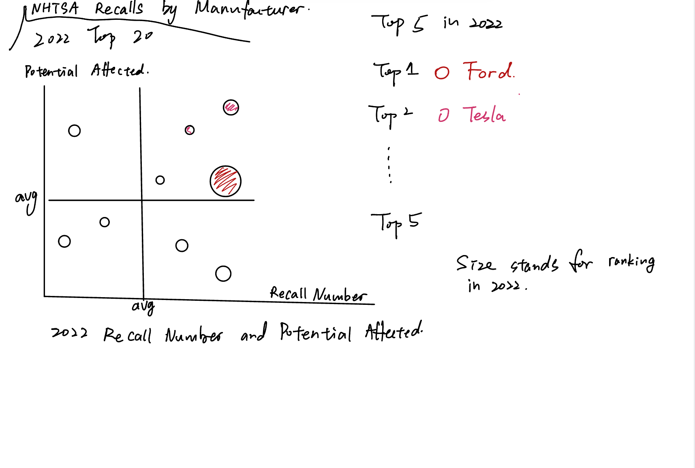

| [Home page](https://xujinyun.github.io/MyDataStory/) | [Visualizing government debt](visualizing-government-debt) | [Critique by design](critique-by-design) | [Final project I](final-project-part-one) | [Final project II](final-project-part-two) | [Final project III](final-project-part-three) |

# Critique by Design with Tableau

## Step 1: choose a data visualization from MakeoverMonday
[National Highway Traffic Safety Administration Automobile Recalls](https://datahub.transportation.gov/Automobiles/NHTSA-Recalls-by-Manufacturer/mu99-t4jn) | [Data](https://data.world/makeovermonday/2023w4)

I selected this data because the story and information is clear and simple. And the original graph has a lot to improve. Also the original data has enough information for further exploration.

<iframe allow="geolocation" src="https://datahub.transportation.gov/dataset/NHTSA-Recalls-by-Manufacturer/mu99-t4jn/embed?width=800&height=600" width="800" height="600" style="border:0; padding: 0; margin: 0;"></iframe>

## Step two: critique the data visualization
Upon the initial glance at the graph, I noted the largest red sector and the abundance of colors. When encountering a variety of rainbow colors, my initial assumption is that these colors might not offer much information. Nevertheless, the red portion remains prominent due to its color and size.

The pie chart makes sense to me. The narrative is very clear and straightforward. The explicit title and legend ensure precise understanding. The area with numbers represents the quantity.

I wasn't fond of the color scheme, which didn't provide any information but distracted me from the information. Personally, I would choose to represent it with light red (1) to dark red (9) to show the recall amount as well. Additionally, I noticed that the data for "potential affected" is not explicitly shown. You only see it when placing your mouse on the pie chart. I consider this data an important component as well. Therefore, another choice is to use light to dark red to demonstrate the potential affected.

Also, the title states "Top 12," but in the chart, there are many manufacturers with 1 or 2 recalls. This makes the chart redundant and not very useful. I can understand that this is because the chart automatically updates with 2024 data, which doesn’t have enough information yet. So, this is understandable, and I believe the chart will look better with more data.

Overall, this evaluation method effectively covers most advantages and disadvantages of the selected data visualization. However, one aspect that seems missing is the exploration of the relationship between the visualization and the original data. While the chart is truthful and precise, it may overlook some crucial information. For instance, the recall ratio, which provides additional insights, is not present in the original dataset.

To enhance the visualization, I recommend incorporating the recall ratio alongside the recall amount. This addition would offer a more comprehensive understanding of the data, providing a richer context for analysis.

Furthermore, as previously mentioned, changing the color scheme is essential. Utilizing a gradient from light red (1) to dark red (9) would not only enhance the aesthetic appeal but also improve the interpretability of the recall amounts, making it easier for the audience to discern and compare the data effectively.

## Step three: sketch out a solution
I took too long time in this sketching and shold increase. The idea of the sketch is showing both recalls numbers and potential affected. I also try to use size and color to provide more information. However, this may cause mess instead.

  

## Step four: Test the solution
The following table contains feedback from two interviewers. Both interviewers are master student from CMU.

| **Interviewer Questions** | **Interviewer 1 Response** | **Interviewer 2 Response** |
|---------------------------|----------------------------|----------------------------|
| Can you tell me what you think this is? | Recall number and ratio | The plot of the brand of vehicles being recalled and their effect. |
| Can you describe to me what this is telling you? | Title | Top 20 car brands with the most recalled car number and the biggest effect. |
| Is there anything you find surprising or confusing? | The factor in 2 axes ARE confusing, Title not clear | Don't know which brand is which marker in the plot. |
| Who do you think is the intended audience for this? | Consumer | People who want to buy cars. |
| Is there anything you would change or do differently? | No need for size | Change the markers in the plot to make each distinguished. |

Both interviewers provide insights into the evaluation of the data visualization. Interviewer 1 highlights confusion regarding the factors represented on the two axes and suggests improving the title's clarity. The intended audience is identified as consumers, and no changes in size are recommended. Interviewer 2 expresses difficulty in distinguishing between brand markers in the plot and proposes changes for better clarity. The visualization is deemed relevant for potential car buyers, presenting information on the top 20 car brands with the most recalls and their respective impacts. Overall, improvements in axis factors and brand marker distinction are suggested for a more effective presentation.

## Step five: Final solution
I have adhered to my initial concept but opted for a lighter graph. The scatter plot in the diagram represents the top 20 manufacturers with recalls in 2022, indicating their potential affected. Both the size and color of the markers convey the number of recalls, with a color scheme ranging from red to yellow. I believe the red portion will attract more attention.

<noscript></noscript><object class='tableauViz'  style='display:none;'><param name='host_url' value='https%3A%2F%2Fpublic.tableau.com%2F' /> <param name='embed_code_version' value='3' /> <param name='site_root' value='' /><param name='name' value='recall_17071036933460&#47;Dashboard1' /><param name='tabs' value='no' /><param name='toolbar' value='yes' /><param name='static_image' value='https:&#47;&#47;public.tableau.com&#47;static&#47;images&#47;re&#47;recall_17071036933460&#47;Dashboard1&#47;1.png' /> <param name='animate_transition' value='yes' /><param name='display_static_image' value='yes' /><param name='display_spinner' value='yes' /><param name='display_overlay' value='yes' /><param name='display_count' value='yes' /><param name='language' value='en-US' /><param name='filter' value='publish=yes' /></object>
                

This design is a simplified version. I initially contemplated incorporating the recall trend over time, but since there is no significant trend and it might complicate the graph, I decided against it.

