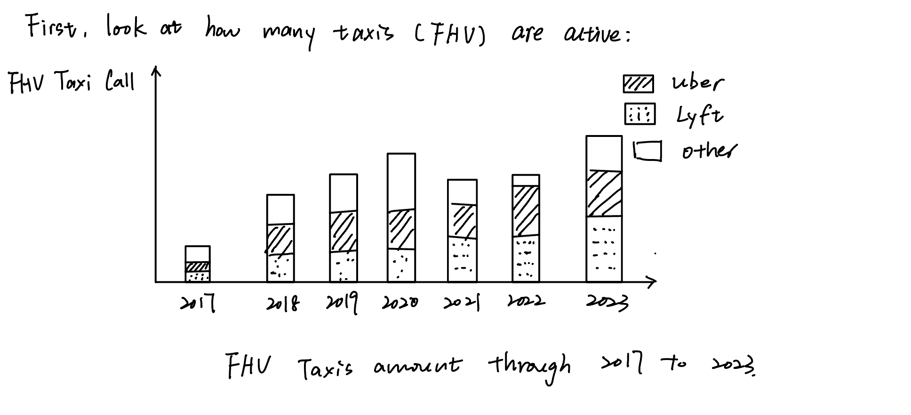
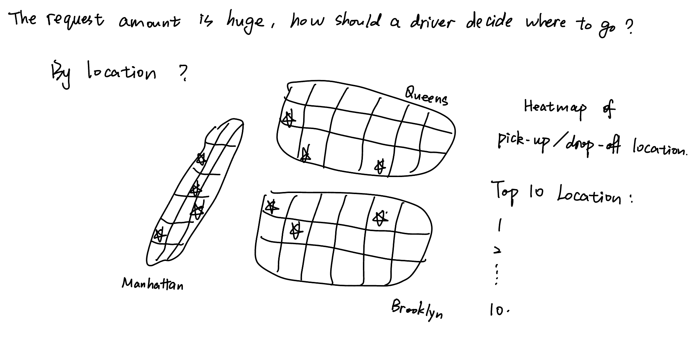
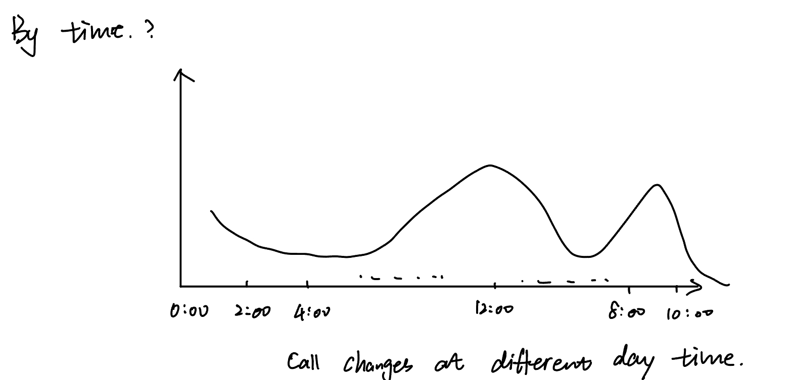
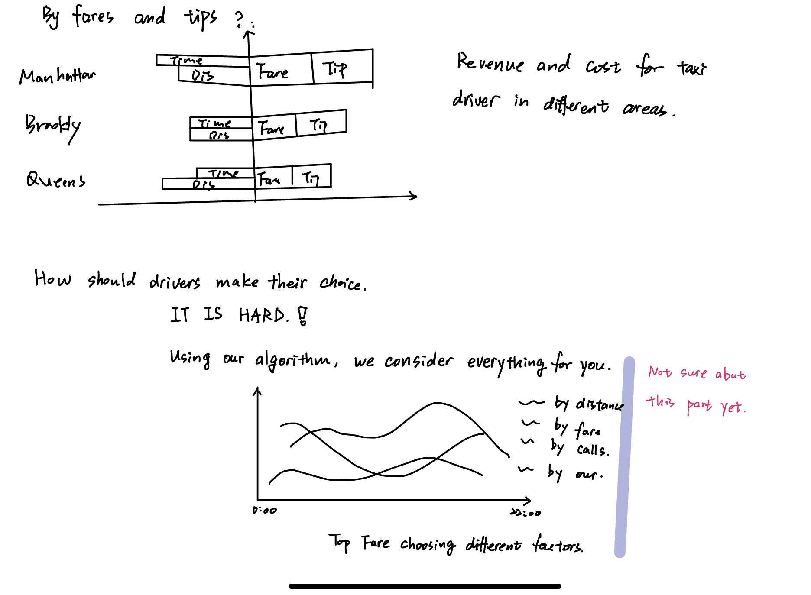

| [Home page](https://xujinyun.github.io/MyDataStory/) | [Visualizing government debt](visualizing-government-debt) | [Critique by design](critique-by-design) | [Final project I](final-project-part-one) | [Final project II](final-project-part-two) | [Final project III](final-project-part-three) |

<!-- > Important note: this template includes major elements of Part I, but the instructions on Canvas are the authoritative source.  Make sure to read through the assignment page and review the rubric to confirm you have everything you need before submitting.  When done, delete these instructions before submitting. -->

# Outline
In the final project, I will delve into the narratives within New York City's taxi data, particularly focusing on Uber and Lyft drivers in 2023. The project's objective is to discover an efficient method for taxi drivers to optimize their profit during daily operations.

Being one of the busiest cities globally, thousands of taxis operate daily in New York City. For taxi drivers, determining the most advantageous routes considering factors such as location, time, traffic, and tips presents a formidable challenge. However, behind the vast amount of data in NYC lie discernible patterns and rules. As a taxi driver, after delving into this narrative, you should gain insights into request distribution over time and location, enabling you to devise strategies to maximize your earnings.

This narrative will delve into historical data, analyzing how each factor influences a taxi driver's income, and ultimately propose novel techniques to assist drivers in finding optimal solutions. The story will commence with a summary of Uber/Lyft taxi data, followed by a detailed examination of the effects of time, location, duration, and tips. Finally, we will showcase improved routing options based on our findings.

## Initial sketches

  
  
  
  

# The data
The NYC taxi data is available on the government website. You can access it through the following [link](https://www.nyc.gov/site/tlc/about/tlc-trip-record-data.page) .

Additionally, here are some other useful links:
- Taxi Zone Lookup Table (CSV): [link](https://d37ci6vzurychx.cloudfront.net/misc/taxi+_zone_lookup.csv)
- Taxi Zone Shapefile (PARQUET): [link](https://d37ci6vzurychx.cloudfront.net/misc/taxi_zones.zip)

The dataset is in PARQUET format. The fields that will be used are listed below:

| Field                   | Description                                                                                                      |
|-------------------------|------------------------------------------------------------------------------------------------------------------|
| Hvfhs_license_num       | The TLC license number of the HVFHS base or business. As of September 2019, the HVFHS licensees are:             |
|                         | - HV0002: Juno                                                                                                   |
|                         | - HV0003: Uber                                                                                                   |
|                         | - HV0004: Via                                                                                                    |
|                         | - HV0005: Lyft                                                                                                   |
| Pickup_datetime         | The date and time of the trip pick-up.                                                                           |
| DropOff_datetime        | The date and time of the trip drop-off.                                                                          |
| PULocationID            | TLC Taxi Zone in which the trip began.                                                                           |
| DOLocationID            | TLC Taxi Zone in which the trip ended.                                                                           |
| request_datetime        | Date/time when passenger requested to be picked up.                                                              |
| trip_miles              | Total miles for passenger trip.                                                                                  |
| trip_time               | Total time in seconds for passenger trip.                                                                        |
| base_passenger_fare     | Base passenger fare before tolls, tips, taxes, and fees.                                                         |
| tips                    | Total amount of tips received from passenger.                                                                    |

# Method and medium
For this project, I will primarily utilize Tableau for data visualization and analysis. In addition to Tableau, I will also generate some figures using Python. The final presentation format will resemble a website. I will integrate the Tableau visualizations and Python-generated figures into the website layout to provide a cohesive and engaging user experience. This approach will allow for seamless navigation and exploration of the NYC taxi data insights.

